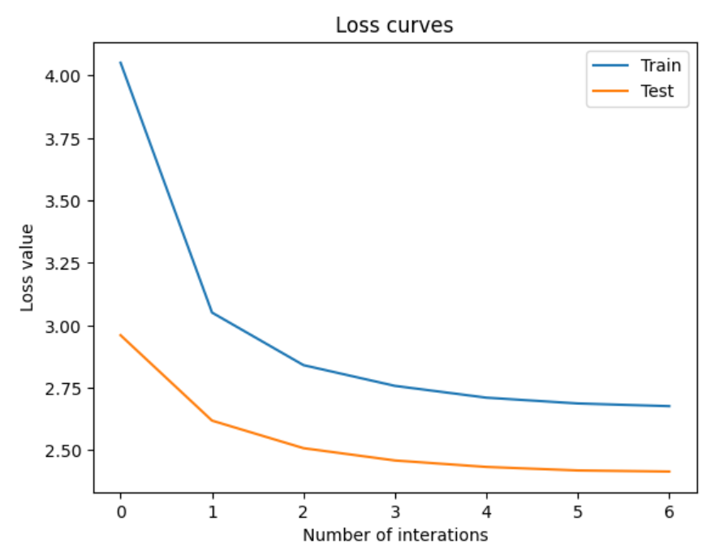

# Team_Full_House_PEFT

## Problem description

Finetuning of Large Language models is often prohibitively costly. Recently there have been developed a number of methods that only fine-tune a small number of (extra) model parameters, thereby greatly decreasing the computational and storage costs. Recent State-of-the-Art techniques achieve performance comparable to that of full fine-tuning.

In our project we aimed to explore the functionality of the library PEFT (Parameter-Efficient Fine-Tuning). It encompasses many SOTA methods and allows for a convenient implementation for any HuggngFace model.

## Results
### Tables (Project_peft_tables.ipynb)

## Conclusion
