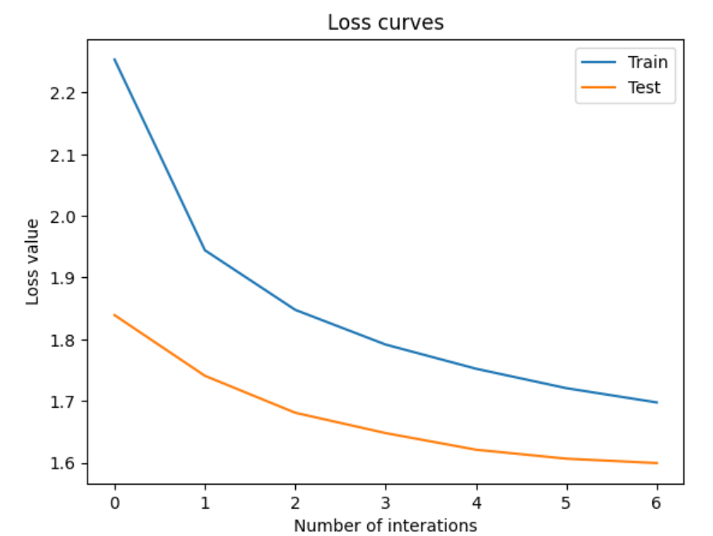
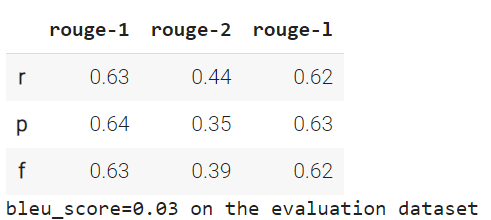
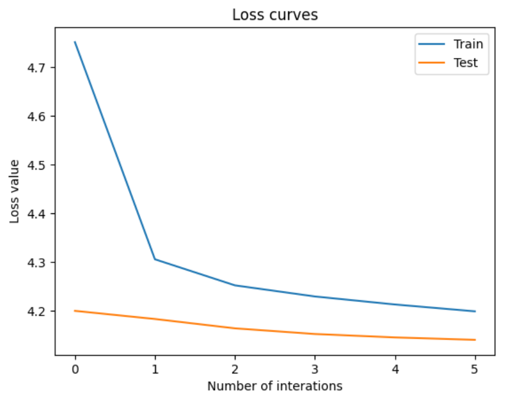
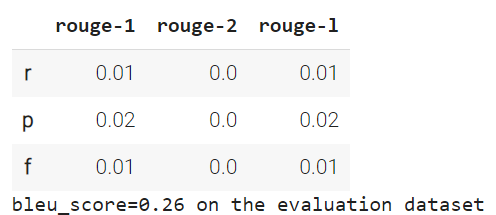
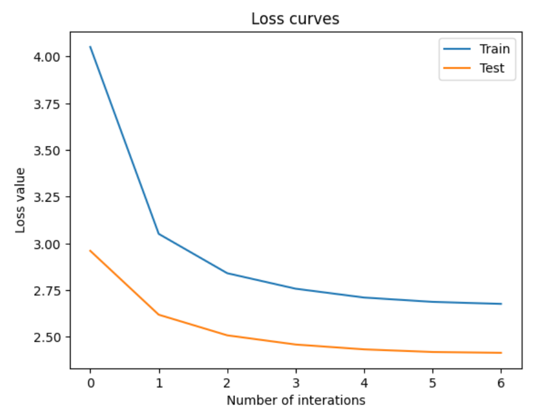
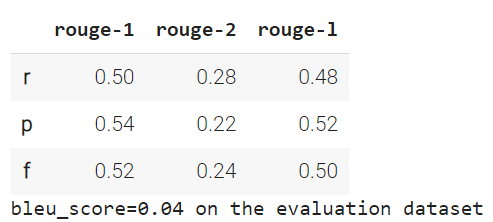

# Team_Full_House_PEFT

## Problem description

Finetuning of Large Language models is often prohibitively costly. Recently there have been developed a number of methods that only fine-tune a small number of (extra) model parameters, thereby greatly decreasing the computational and storage costs. Recent State-of-the-Art techniques achieve performance comparable to that of full fine-tuning.

In our project we aimed to explore the functionality of the library PEFT (Parameter-Efficient Fine-Tuning). It encompasses many SOTA methods and allows for a convenient implementation for any HuggngFace model.

## Results
### Tables (Project_peft_tables.ipynb)
* Below you can see the results of utilizing LoRA

  

**Example of the model output:** 'Bulgaria : Ratio of government expenditure to gross domestic product ( GDP ) from 2015 to 2025 Ghana Ghana Ghana Ghana Ghana Ghana Bulgaria ... Bulgaria Rat Rat Rat India India India India India India India India India India'

'...' denotes 'Bulgaria' repeated a lot of times. 

**Corresponding target:** 'France : Ratio of government expenditure to gross domestic product ( GDP ) from 2015 to 2025'

The strings nearly coincide before inadequate repetitions.

Here are the results of making use of AdaLoRA

  

Finally, that is what we have got for Prefix Tuning

  

## Conclusion
