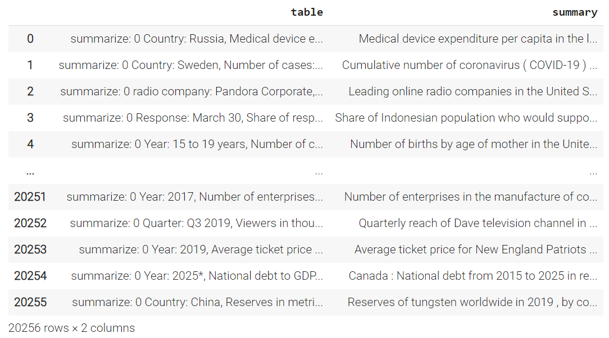
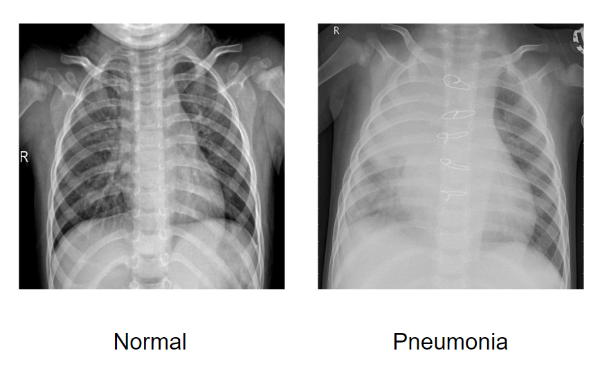
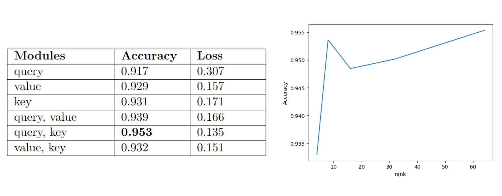

# Team_Full_House_PEFT

## Problem description

Finetuning Large Language models is often prohibitively costly. Recently there have been developed a number of methods that only fine-tune a small number of (extra) model parameters, thereby greatly decreasing the computational and storage costs. Recent State-of-the-Art techniques achieve performance comparable to that of full fine-tuning.

In our project we aimed to explore the functionality of the library PEFT (Parameter-Efficient Fine-Tuning). It encompasses many SOTA methods and allows for a convenient implementation for any HuggngFace model.

## Results
### Tables (Project_peft_tables.ipynb)
For this part we used the tables from HW 2, preprocessed into strings. The goal was to summarize their content (targets were given). Here is how the data looked like:

 

* Below you can see the results of utilizing LoRA on T5 model

  

**Example of the model output:** 'Bulgaria : Ratio of government expenditure to gross domestic product ( GDP ) from 2015 to 2025 Ghana Ghana Ghana Ghana Ghana Ghana Bulgaria ... Bulgaria Rat Rat Rat India India India India India India India India India India'

'...' denotes 'Bulgaria' repeated a lot of times. 

**Corresponding target:** 'France : Ratio of government expenditure to gross domestic product ( GDP ) from 2015 to 2025'

The strings nearly coincide before inadequate repetitions.

* Here are the results of making use of AdaLoRA on BART model

  

**Example of the model output:** 'both annuala well Empires iPad ganzberen special have hisatings lastX annualenen well well well well well well wellsssssssssssssssssssssssssssssssssssssssssssXsssssssssssssssssssssssssssssss semi semi semis semi much much much much much much much,,,,,,,,,,,,'

**Corresponding target:** 'France : Ratio of government expenditure to gross domestic product ( GDP ) from 2015 to 2025'

This is a complete fail.

* Finally, that is what we have got for Prefix Tuning on T5 model

  

**Example of the model output:** 'Rat : Ratio of government expenditure to GDP domestic product ( GDP ) from 2015 to 2025 ( Rat ... Rat'

'...' denotes 'Rat' repeated a lot of times. 

**Corresponding target:** 'France : Ratio of government expenditure to gross domestic product ( GDP ) from 2015 to 2025'

As in case of LoRA we see somewhat close to the ground truth again with uncanny repetitions.

## Conclusion
* LoRA and Prefix Tuning on T5 model have proven themselves to give promising results on the table description task possibly leading to great performance, while AdaLoRA method applied to BART model requires further investigation
* For image classification, LoRA manages to achieve good accuracy with around 2.5% of parameters, getting 90%+ accuracy on new dataset from the second epoch.
* LoRA achieved peak accuracy from just very few epochs of fine-tuning while manipulating only a small fracture of less than 0.5% of parameters.

### Images (Project_peft_image.ipynb)

Dataset Chest X-ray Pneumonia for classify normal and pneumonia lungs.

 

LoRA allows to apply weight updates to different layers (query, value, key). In tutorial authors use query + value, in our example the best result reached in query + key. We also show a small increase in the accuracy of fine-tuning model from the rank of approximation.

 

